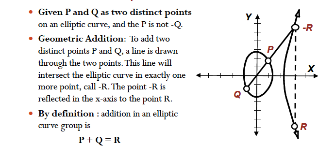
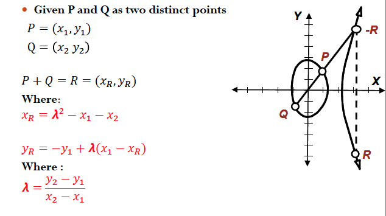
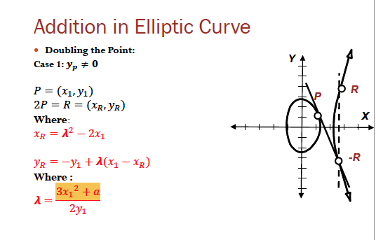
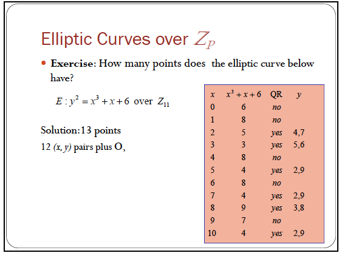
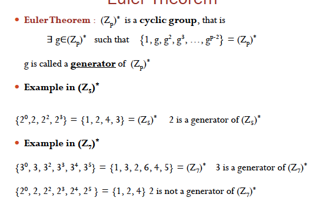
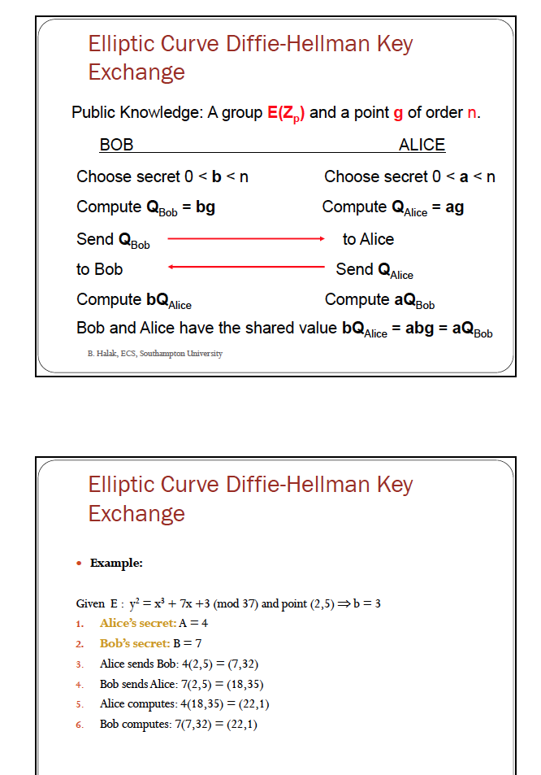

# Elliptic Curve Cryptography

## Restriction

* polynomial x^3 +ax + b has a double root, cannot be used to construct a cryptographic system
* so the condition is 4a^3+ 27b^2 ≠ 0 (ensures the curve has three distinct root)

## Importance

* one importance of elliptic curves is that they have a natural abelian group structure

## Addition in Elliptic Curve

* given P and Q are two distinct points
* 
* 
* given the points p and -p on curve
	* this is the reason why includes the point at infinity 
* doubling the point
	* P+P = 2P = R
	* 
	* case 2: 2P = O for a point P 
		* 3p = p, 4P = o
## Groups 

* if G is a group ,it has following properties
	* closure a*b in the G
	* associativity a*b*c=a*(b*c)
	* identity a*e=a=e*a
	* invertability a*ai=e=ai*a

	### Abelian Groups
	
	* a group G is said to be commutative (abelian), if a*b=b*a for all a,b in the G
	* Theorem:
		* Any elliptic curve E over F is an ebelian group under the operarition + defined above:
		* so, P+Q+R=P+(Q+R);P+O=p;P+-P=O; P+Q=Q+P
		* <mark>4a^3 + 27b^2 !=0 </mark> 

## Elliptic Curves over Zp

* in the curves , all computation are done mod(p)
* example: 
	* find all points on the elliptic curve
	* Step:
		1. 	check the validity of the equation: 4a^3 +27b^2 =59 = 4 mod5(!=0)
		2. calculate all the points on the elliptic curve  
x=0,1,2,3,4(in mod 5), calculate the square root.

	### Properties
	
	* <mark>	order： denote as |E| and it refers to the number of point on the curve plus O <mark>
	*  bounds:
		p+1-2√p ≤ |E| ≤ p+1+2√p
	* 	 	

## Construct key exchange protocols based on elliptic curve

### Euler Theorem
-------

* (Zp)* is a cyclic group
	* 
	* < g >: the set {1,g,g^2,g^3....g^n }is called the group generated by g
	* the order of g is the size of < g >: orderp(g) = smallest a s.t. g^a = 1 in Zp
	* <mark>用来猜测generator <mark>
	* for example:
		* ord7(3)=6={1,2,3,4,5,6}
		* ord7(2)=3!= group size

### elliptic curve discrete logarithm problem
--------

* given P and Q in an curve find an integer i satisfying Q = i . p
* depends on how difficult it is to determine i given ip and p, this is <mark>elliptic curve logarithm prblem</mark>
* use smaller numbers for equivalent level of security
* 
	* a point g of order n, choose secret a,b
	* for Alice: Qalice=ag, for Bob: Qbob=bg;
	* Bob send Qbob to alice
	* Alice send Qalice to Bob 
	* shared value bQalice= aQbob = abg
* for example in picture 
* comparable key size for equivalent security
	* if symmetric scheme is n bits , ecc based is 2n 

## Cyclic Elliptic Curve Groups

* A finite abelian group F is cyclic if and only if prime p dividing |G| it has fewer than p^2-1 elements of order p
* lemma: if the order of an elliptic curve E over a finite field fQ denote |E| is a prime number then the group is cyclic and every element is a generator

