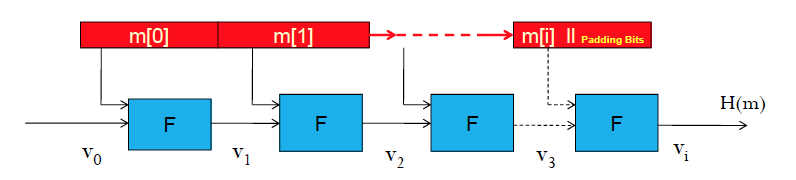

# Message Authenticity and Digital Signature

## Message Integrity

* message integrity : ensure that a received message has actually <mark> originated from the intended party and was not modified even if an attacker controls the pannel</mark>
	* application example: protecting systems from virus 
	* ensuring the integrity of banks transaction
	* secrey and integrity are orthonogonal concern
	* encryption does not provide integrity

## message authentication code(MAC)

* message authentication code is defined by two algorithm
	* signing algorithm(to generate tag):  
input a message m and key k  
outputs a tag t
	* verification algotimn:  
input: key k, message m and tag t   
output: 1(accept) and 0(reject)
* Definition: MAC I=(S,V) defined over (k,m,t) is a pair of algorithm  
S(k,m)---> t, V(k,m,t)------>1 or 0
* consistency condition: For all m and responding k, V(m,k, s(K,M))=1
* importance of secret key
	* adversary power: <mark>Chosen Message Attack</mark>
	* 
* Forgery
	* An attacker is able to produce a pair(m' ,t'),m' does not originate from the sender and V(m',k,t')=1. this pair m', t' is called forgery and the attacker is said to have forged.
	* 有效信息不是从发送者那边发过的
	* Attack Model: chosen- messagee attack: to construct a secure MAC, we assume worst case, attacker is assumed to be able to induce the sender to authenticate message of the attacker`s choice(引诱发送者验证攻击者的信息)

## MAC Security Definition

* security goal: existential unforgeability
* a mac is said to be secure: if and only if Mac is able to detect any attempt by the adversary to modify the transmitted data
* attackers should not be able to produce a new valid mt pair or even produce a new tag for an old message. 攻击者不应该生成一个有效的（m,t） 甚至不能为一个旧的消息产生一个新tag

## replay attack
### Replay Attack
* replay attack: when an attacker re-send old messages which have valid tags.(攻击者重新发送有有效tag的旧信息)
	* are not prevented by the use of MAC (no statement can prevent)
* (Review) 

### Chosen Message Attack

adversary chooses pt and is then given corresponding ct.the adversary uses any information deduced(推断) in order to recover plaintext corresponding to previous unseen ct.

### known plaintext attack

adversary has a quantity of PT and CT(difficult to mount)

### CipherText only Attack

Through only observing the CT .

### side channel attack

analtsis of information leaked from the physical implementation of the system.(electromagnetic radiation, power consumption,sounds)

## Construct Mac based on symmetric cipher

* Persudo Random Function: F:K x X---> Y
* Persudo Random Permutation: E: K x X ---> X
	* exists efficient deterministic algorithm to evaluate E(k,x)
	* function is one to one
	* exists efficient invertion
* Mac can be constructed from a secure PRF as follow
	* F:K x X ---> Y define a MAC = (S,V)
		* S(k,m) := F(k,m)
		* V(k,m,t) outputs 1 or 0
		* 对于签名系统来说S 由 F 构建f（k,m）
		* eg. aes -128 为16bytes 的message创建mac
* Goal: 
	* given PRF for short message construct a PRF for long message
	* ECBC AND HMAC
	* convert small MAC to a big MAC

### ECBC

* Definition: F: K x X---> X be a PRP. M devided into m[0]../...m[q-1]
	* S(k1,k2,m) =. Fecbc(k1,k2,m)
	* V(k1,k2,m,t) 1: if t =. Fecbc(k1,k2,m)  
0 : otherwise

<mark>k1 is to generate the each small F, k2 is the last step key</mark>
* Raw CBC:
	* no key2
	* simple attack on RAW CBC
		* Adversary chooses an arbitrary one-block message m
		* request a tag for m t=F(k,m)(choosen message attack)
		* He simply output t as MAC forgery for the 2-block message
		* F(k,(m+t xor m))=F(k, F(k,m) xor (t xor m))= F(k,t xor (t xor m))= F(k,m)=t

### Hashed Message Authentication code

#### Hash Function
* maps arbitrary length inputs to a short fixed length digest
* H:{0,1}N ---> {0,1}n
* application: 
	* store username , h(passwork)
	* build MAC
	* build a one-way password file 
	* intrusion detection and virus detection by creating hash on system and moitor any changes入侵者检测，病毒检测
* Pre-image:
	* if y=H(x) ,x is the pre-image of y. (Each hash value might have multiple pre-images)
	* A collision is a pair of distinct imput x,x` such that H(x)=H(x')
* Hash Function Security Requirements
	* Pre-image resistant(抵制)  
	if it is computatioanally infeasible to find a pre-image of a hash value (given y it is infeasible不可实行的 to find an x such that h(x)=y)
	* Collision resistant  
	given x and hx, infeasible to find y≠ x such that h(y)=h(x)
	infeasible to find any x and y with H(x)=H(y)

#### Collision Resistant Hash Function(Merkle -Damgard Scheme)

* principles:
	* the message is broken into blocks of size K
	* Padding bits are appended to the last block if its size is smaller than k填充加载最后如果值小于k
	* multiple of k, extra padding block will be added
	* padding bits include a series of 1000(end of the message) and include the length of message
	* initial V0 is fixed 
	* F is collision resistant compression function
* if F is collision resistant, result H is collision resistant
* Collision resistant compression function
	* The Davis- Meyer compression function F is constructed as F(V,m)= E(m,H) XOR H (E is a block cipher E(K x {0,1}n --->{0,1}n))
	* 

#### SHA-256

* BASED on Merkle -Damgard Scheme
* 

#### Keyed Hash Function

* to achieve authenticity: MAC should include a key along with message so original proposal was as follow: S(k,m)= H(k|| m)
* HMAC:

* security of MAC from Hash Function:
	* collision resistant is important.
	* if not collision resistant: S is insecure using chosen message attack.
		* an advasory finds, m0≠m1 but Hm0,k=Hm1,k
		* He asks for S(k,m0)--->t,but m1,t could be a forgery
* attacks on Hash Function
	* Brute Force attack
	* Birthday Attack
		* for i=1...2^(n/2) compute ti=H(mi) 
		* look for a collision (ti=tj)

## Digital Signature

* on a message is additional data which procide:
	* Data origin authentication of the signer 身份认证
	* Non-repudiation 不可否认
* DSS: (G,S,V)
	* key genereation algorithm
	* signing algorithm S(sk,m) outputs t
	* signature verifying : V(pk,m,t)
* RSA Digital Signature Scheme:
	* choose random p,q
	* N=p.q
	* ed=1mod(𝝋(N))
	* pk=(N,e) sk=(p,q,d)
	* signing algorithm: F: y=x^d
	* signature verification algorithm: F: RSA(y,e)=y^e
	* if y^e = x --->1
* Simple attack
	* 
	* 