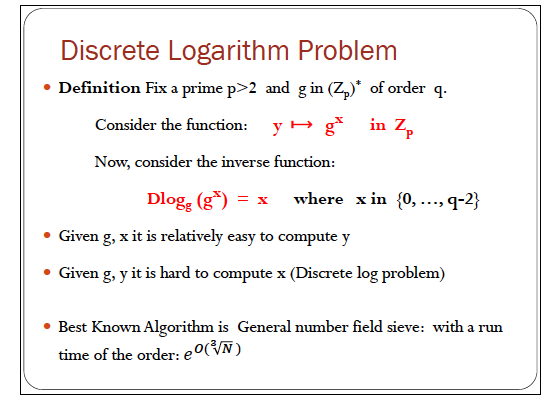

# Number Theory

## Euler Totient Function(𝝋(N))

* 𝝋(N)=N-1   N is a prime  
𝝋(N)=(p-1)(q-1)	N is not a prime, but p,q is Prime

## Euler Theorom

a generalisation of Fermat Theorem
x^𝝋(N) mod N =1

## Invertible

* Zn = {0,1,2,...N-1}, (Zn)* = {invertible elements in Zn}
* using Elidean Algorithm, find 1= xx*xx+xx*xx
* using Fermat Little Theorem:
	Fermat theorem: p be a prime , x^p-1 = 1 in Zp
	<mark>x^(-1) = x^(p-2) in Zp</mark>
* invertible:
	* gcd(x,N)=1
	* Number of elementd in (Zn)* : 𝝋(N) =(p-1)()

## Find the gcd

Euclid's Algorithm

## Square root
1. gcd(e,p-1)≠1
	- special case
		- x^(p-1)/2 = 1 in Zp , if p is an odd prime.
		- case 1: p = 3 mod 4
			- √c = c^(p+1)/4 in Zp
		- case 2 : p= 1 mod 4
			- random algorithm
2. gcd(e,p-1)=1
	find modular invers of e in Zp-1
	compute c^1/e =c^d in Zp 

## Discrete Logarithm Problem

