# Symmetric Cryptographic System

## Information and entropy

### entropy

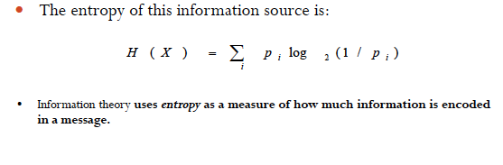

* definition: how much information is encoded in a message
* How much we can compress
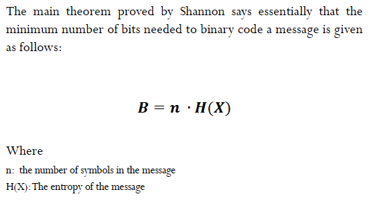

## Cryptography

### Shared Key System

* Shared Key System: both sender and receiver use the same key which must remain private(Symmetric)
	* example: DES,3-DES
	
### Block Cipher & Stream Cipher

* Block Cipher: a block of pt is treated as a whole and used to produce a ct block of equal length.(128 bits as usual. for example:AES)
* Stream Cipher: pt is encrypted one bit or one byte at a time .(for example. XOR cipher.)

### Problems with Share Key System

* compromised key means interceptors can decrypt any ct they have required .共享密钥意味着拦截器可以截获任何ct并解密。（solution： changed frequently）
* Distribution of keys: must be transmiited securely.密钥要安全的传输

## Symmetric Cipher

### Definition

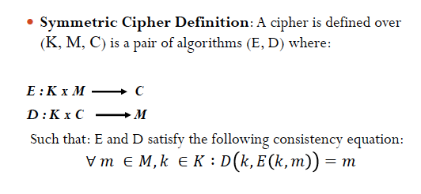

### Shannon Perfect Secrecy

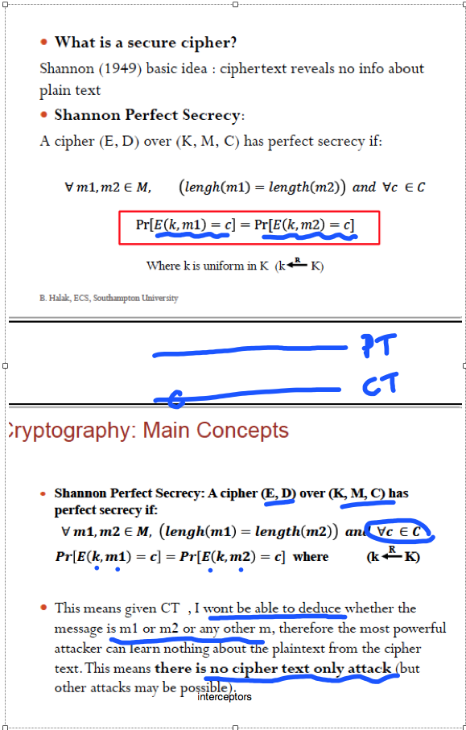

对于ct上的某一位c来说，通过m得到c的概率是一样的。无法推断c是encrypt了哪个m。也就是说没有单独的ct攻击

#### Example of Shannon Secrecy
1. shift cipher
	Pr[E(k,m1) = c] = 1/26. However, E(k,m2) ≠ c, hence Pr[E(k,m2)=c]=0  
	so the perfect secrecy requirement is violated. shift cipher is prone to cipher text only attack.

2. One Time Pad
	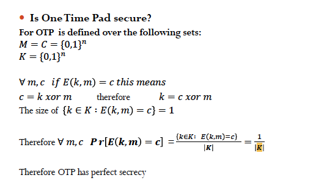 
	Perfect secrecy.
	* to achieve the perfect secrecy: |K| ≥ |M|

#### Limitation
* shannon notion of perfect secrecy is too strong to be useful
* shannon notion of perfect secrecy is only related to ct attack
* so, relax the notion.

#### Computational Perfect Secrecy

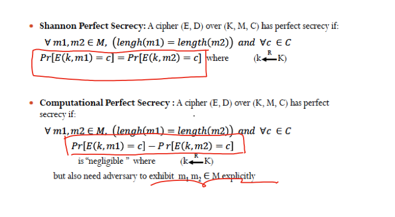
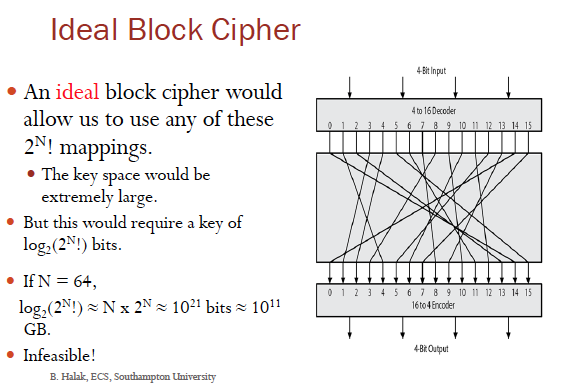

## Block Cipher Construct

### PRP & PRF

* PRF: persudo random function(K,X,Y): K x X ----> Y
* PRP: persudo random permutation (K,X): K x X ----> X
	* exists efficient deterministic algorithm to evaluate E(K,X)
	* function E(k,.)is one-to-one.
	* exists invertion function
	* example: 
		* AES: K x X--> X where K=X={0,1}^128
		* 3DES: k x X--->X where X={0,1}^64,K={0,1}^168
	* A PRP is a PRF where X=Y and efficiently invertible

### Semantically Secure

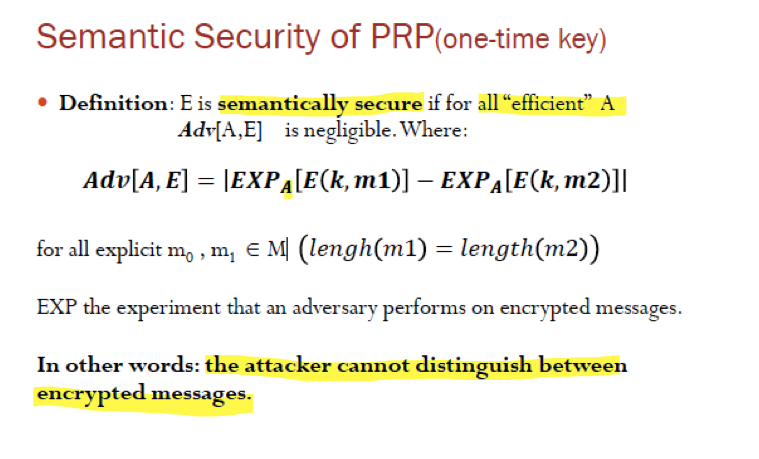

## 3Des

### Shannon confusion and Diffusion

- completely obscure statical properties of orginal message
- Using permutation(置换) and substitution（替代）
	- diffusion: dissipate the redundancy of pt by spreading it out over the ct.(earliest: permutation)消除明文的冗余
	- confusion: Obscure the relationship between ct and pt in order to hode any statical patterns. (through subsititution)

### DES

#### Feistel Structure
- avoid the complexity problem of ideal block cipher.
- using substitution and permutation
- 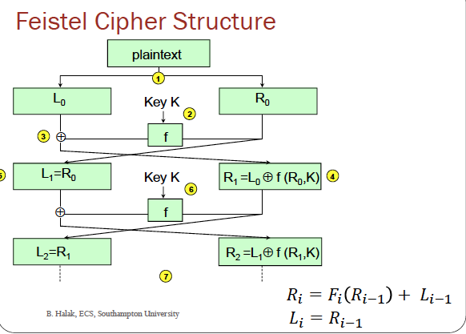
- left halve is a substitution and the permutation happens in the cross part
- Implementation:
	- Block Size: larger, more secure.but reduce the speed(64bits is reasonable)
	- Key Size: 64bits not secure, 128bits is preferred
	- Number of rounds: 16 is standard
	- Subkey generation: more complex , more secure
	- Round function

| CIPHER | number of rounds | Block size | length of key |
|:--------|----------------|------|----|----|
|feistel Cipher| 16 | 64 | 56 |

#### DES

- specific to DES
	- the design of the F function
	- how round key is derived from the main key
- F function in the Feistel of DES
	- L and R each has 32 bits. round key is 48
	- F(R,K)= P(S(E(R)XOR K))
	- E: 32 bits to 48 bits  
	S: 48 bits to 32 bits  
	P: permitates 32 bits
- Permutation:
	- permutations: 32 bits to 32 bits (shuffle)
	- compression permutation: 56 bits to 48 bits
	- Expansion permutation: 32 bit (shuffle and mapped) to 48 bits by duplicating 16 input bits
- Subsititution: 48 bits of data are devided into 8 block of 6 bits. 8 S- box each map 6 to 4 bits
	 - S(101010)= 6: 10(2进制)=2(10进制)---行号； 0101（中间四位）= 5 列号
 - s-box and P-box choice 
	 - if choose random , will cause insecure block ciphre. will close to linear function.
	 - rules of choice of S-boxes:
		 - No output bit should be close to linear function of input bits
 - Problems of DES
	 - Secret design,but fear of trapdoor has proved baseless
	 - keys are weak
	 - length: 56bits is inadequate
	 - a small change on the pt result bid change in ct
	 - high degree of diffusion and confusion
	 - change 1 bit of pt will cause 34 bits change on average
	 - 1 bit change in key will cause 35 bits in the ct

#### Triple DES

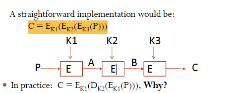
 
 -double DES will cause meet in the middle attack
 
 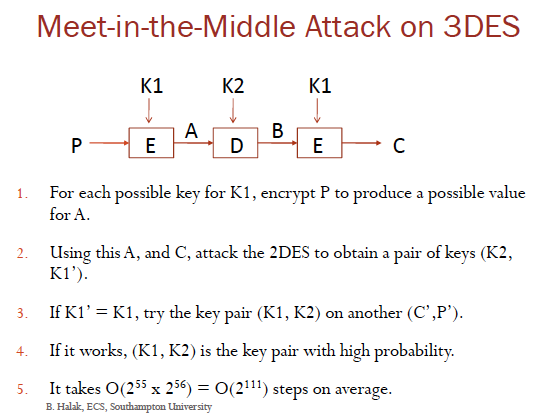
 
###  AES

- Based on substitution-permutation network and not Feistel Network
- Each block cipher is 128 bit , devide into 16 bytes
- 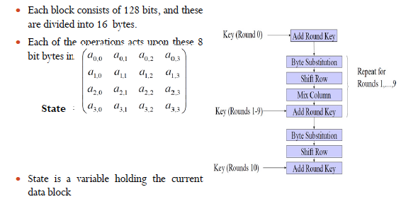
- inside each byte, A Polynumial
	- addition is xor
	- multiple will decvide by the prime polynomial above
- For Each Step:
	- Byte sbstitution: Sub(a)=Aa^-1 +b
	- Shift row: shift to the <mark>left</mark> with offset 0,1,2,3
	- Mix Column Matrix d = shift row matrix XOR c
	- Add Round Key = d XOR k
- Round Key
	- 128 bits= 4*4 matrix of bytes
	- if it is multiple of 4, wi=wi-4 xor t(w(i-1))
		- replace each byte with S- box
	- round     key length
		10			128
		12			192
		14			256

### Electronic Code Book 

- weakness: repetitive information show in the cipher, if aligned with blocks
- use ECB securely when message length is equal to block length and change the key for each message
- could prone to attacks such as chosen plaintext attack 

### Cipher Block Chaining 

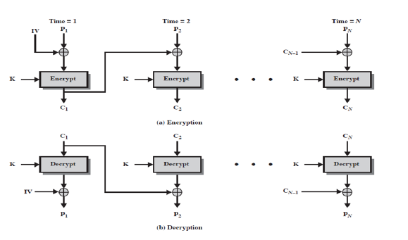

<mark>
1. - Review on CBC
1. -same key will use for all blocks
1. - error proporgate
1. - Iv must be known both sender and receiver
2. serial processimg</mark>

suppose we want adv cpa[a,ecbc]≤ 1/2^40 and adv prp[a,e] is negligible, this means q^2L^2/|x| < 1/2^40

For AES |X|= 2^218. qL < 2^44
For 3DES |X| =2^64   qL < 2^12

### Counter Mode

- initial vector increment
- weakness:
	- same key is used for all blocks
	- IV should not be reused

### CFB

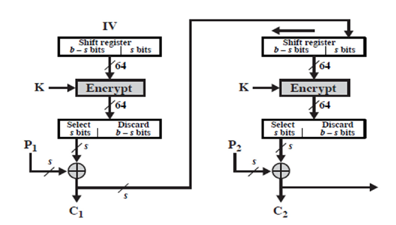

Decryption:

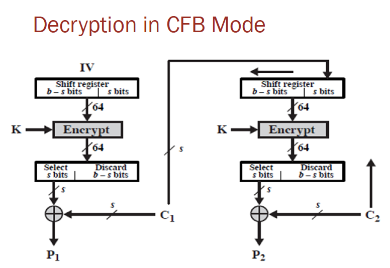

Remark:

- as stream cipher
- s could be any value, as common is 8
- ciphertext depends on the current and all preceding plaintext segment
- a corrupted ciphertext segment during transmission will affect the current and next several plaintext segment.

### OFB

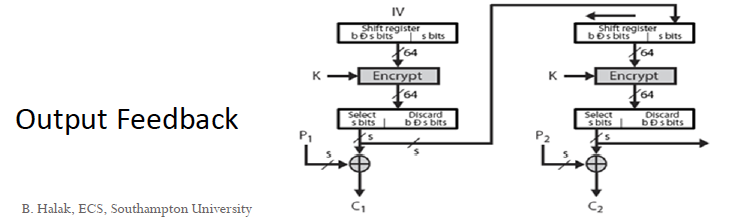

## Types of Attack

### Cipher-texy-only attack

adversary tries to deduce the decryption key or plaintext by only observing ciphertext.

### A known plaintext attack

a quantity of plaintext and corresponding ciphertext. 

- Chosen plaintext attack
	- choose plaintext and given corresponding ciphertext.

### Side Channel Attacks

based on the analysis of information leaked from the physical implementation of the system 

- example : exploits correlation between the power consumption of the cipher hardware and the data being processed.
- 